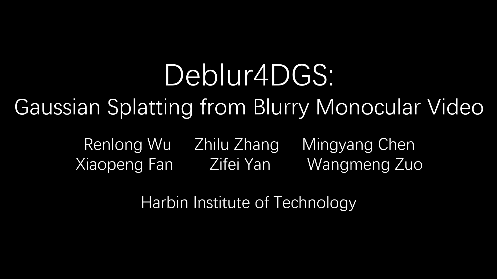
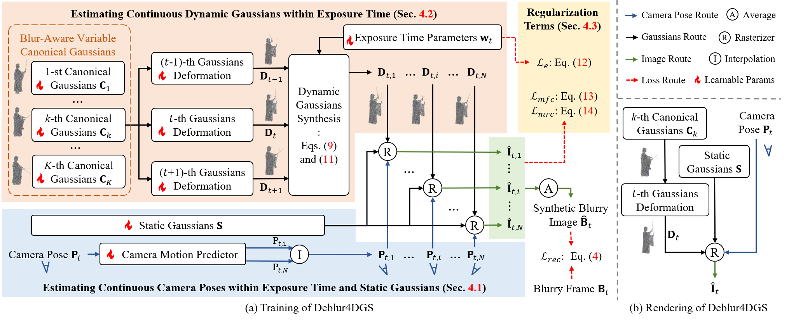
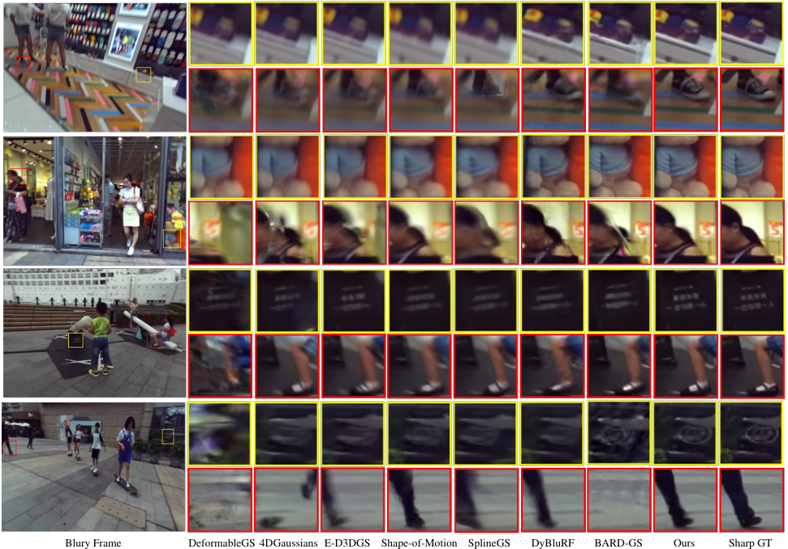

# Deblur4DGS
PyTorch implementation of [**Deblur4DGS: 4D Gaussian Splatting from Blurry Monocular Video**](https://arxiv.org/abs/2412.06424)


[](https://arxiv.org/abs/2412.06424)
[](https://deblur4dgs.github.io/)


<!-- [](https://www.youtube.com/watch?v=1I2N2IDneUQ) -->

[](https://www.youtube.com/watch?v=1I2N2IDneUQ)

## 1. Abstract
Recent 4D reconstruction methods have yielded impressive results but rely on sharp videos as supervision. However, motion blur often occurs in videos due to camera shake and object movement, while existing methods render blurry results when using such videos for reconstructing 4D models. Although a few approaches attempted to address the problem, they struggled to produce high-quality results, due to the inaccuracy in estimating continuous dynamic representations within the exposure time. Encouraged by recent works in 3D motion trajectory modeling using 3D Gaussian Splatting (3DGS), we take 3DGS as the scene representation manner, and propose Deblur4DGS to reconstruct a high-quality 4D model from blurry monocular video. Specifically, we transform continuous dynamic representations estimation within an exposure time into the exposure time estimation. Moreover, we introduce the exposure regularization term, multi-frame, and multi-resolution consistency regularization term to avoid trivial solutions. Furthermore, to better represent objects with large motion, we suggest blur-aware variable canonical Gaussians. Beyond novel-view synthesis, Deblur4DGS can be applied to improve blurry video from multiple perspectives, including deblurring, frame interpolation, and video stabilization. Extensive experiments in both synthetic and real-world data on the above four tasks show that Deblur4DGS outperforms state-of-the-art 4D reconstruction methods.


## 2. Method

<p align="center"></p>

<p>  Training and Rendering of Deblur4DGS. Deblur4DGS produces the sharp image with user-provided timestamp and camera pose.</p>

## 3. Novel-View Synthesis Results


Compared with state-of-the-art 4D reconstruction methods, Deblur4DGS produces more visually pleasant results in both static and dynamic areas, as marked with yellow and red boxes respectively.

## 4. Datasets and Quick Start
### 4.1. Datasets
Please download the data at https://pan.baidu.com/s/1-vzJKH27_T580rSwWgxN8w?pwd=6zn7.

For your custom data, please refer to [Shape-of-Motion](https://github.com/vye16/shape-of-motion) to pre-process data.

### 4.2. Prerequisites

We use cuda12.2 and provide detailed dependencies in requirements.txt.


### 4.3. Quick Start 
- Train on 288x512 dataset, run [`bash ./train_low.sh`](./train_low.sh)
- Train on 720x1280 dataset, run [`bash ./train_high.sh`](./train_high.sh)

## Acknowledgement

Special thanks to the following awesome projects!

- [Shape-of-Motion](https://github.com/vye16/shape-of-motion)
- [BAD-Gaussian](https://github.com/WU-CVGL/BAD-Gaussians)

## Citation
If you make use of our work, please cite our paper.
```bibtex
@article{Deblur4DGS,
  title={Deblur4DGS: 4D Gaussian Splatting from Blurry Monocular Video},
  author={Wu, Renlong and Zhang, Zhilu and Chen, Mingyang and Yan, Zifei, and Zuo, Wangmeng},
  journal={AAAI},
  year={2026}
}
```
